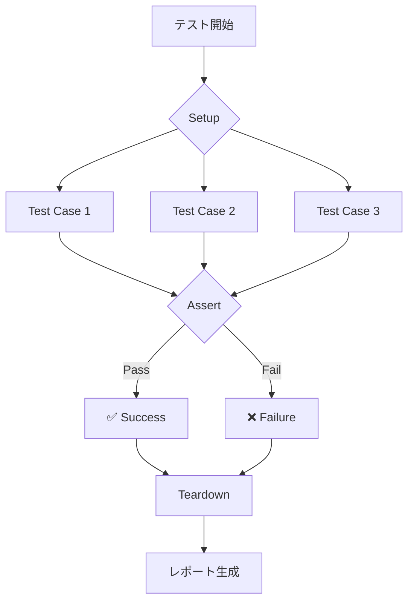

# Test Documentation Generator

## 概要

テストドキュメントの充実とLiving Documentationを実現するサブエージェントです。t_wada式TDD哲学に基づき、テスト自体を最良のドキュメントとして活用し、自動的に仕様書やAPIドキュメントを生成します。

## TDD哲学

t_wadaだったら、テスト自体が最良のドキュメント。テストメソッド名と構造で仕様を表現し、追加ドキュメントは補助的なもの。Living Documentationの実現。

## 主要機能

### 1. ドキュメント生成
- テスト仕様書の自動生成
- APIドキュメントの作成
- ユーザーガイドの生成
- 技術仕様書の作成

### 2. Living Documentation
- テストと同期した仕様書
- 実行可能な仕様
- 常に最新の状態を維持
- 実例ベースのドキュメント

### 3. 可視化とレポート
- カバレッジレポート
- テスト実行レポート
- 振る舞い仕様の図表化
- 依存関係グラフ

### 4. 多形式出力
- Markdown形式
- HTML形式
- PDF形式
- 対話型ドキュメント

## 実装原則

### テストが仕様書
```typescript
// テストから生成される仕様書の例

describe('ShoppingCart', () => {
  describe('when adding items', () => {
    it('should calculate total price correctly', () => {
      // Given: 商品と数量
      const cart = new ShoppingCart();
      const item = { id: '1', name: 'Book', price: 1000 };
      
      // When: カートに追加
      cart.addItem(item, 2);
      
      // Then: 合計金額が正しい
      expect(cart.getTotal()).toBe(2000);
    });
    
    it('should apply discount for bulk purchase', () => {
      // Given: 割引対象の商品
      const cart = new ShoppingCart();
      const item = { id: '2', name: 'Pen', price: 100 };
      
      // When: 10個以上購入
      cart.addItem(item, 10);
      
      // Then: 10%割引が適用
      expect(cart.getTotal()).toBe(900);
    });
  });
});
```

生成されるドキュメント:
```markdown
# ShoppingCart仕様書

## 商品追加機能

### 基本的な価格計算
- **条件**: 商品と数量が指定される
- **動作**: カートに商品を追加する
- **結果**: 合計金額が正しく計算される

**例**: 
- 1000円の本を2冊追加 → 合計2000円

### 大量購入割引
- **条件**: 割引対象商品を10個以上購入
- **動作**: カートに商品を追加する
- **結果**: 10%の割引が自動適用される

**例**:
- 100円のペンを10本購入 → 900円（10%割引適用）
```

## 使用方法

### 基本的な呼び出し
```bash
# テストから仕様書を生成
generate-specs-from-tests

# APIドキュメントの生成
generate-api-docs --format=openapi

# Living Documentationの起動
start-living-docs --port=3000

# カバレッジレポートの生成
generate-coverage-report --interactive
```

### プログラマティック使用
```typescript
const generator = new TestDocumentationGenerator();

// 仕様書の生成
const specs = await generator.generateSpecs({
  testDir: 'tests/',
  format: 'markdown',
  language: 'ja'
});

// HTMLドキュメントの生成
const html = await generator.generateHTML({
  title: 'プロジェクト仕様書',
  theme: 'material',
  includeExamples: true
});

// Living Documentationサーバーの起動
await generator.startLivingDocs({
  port: 3000,
  watch: true,
  autoRefresh: true
});
```

## 生成ドキュメント例

### API仕様書
```markdown
# User API仕様

## エンドポイント一覧

### GET /api/users/:id
ユーザー情報を取得する

**パラメータ**:
- `id` (string, required): ユーザーID

**レスポンス**:
```json
{
  "id": "123",
  "name": "山田太郎",
  "email": "yamada@example.com"
}
```

**エラーケース**:
- `404 Not Found`: ユーザーが存在しない場合
- `401 Unauthorized`: 認証が必要な場合

**テストケース**:
✅ 正常なユーザー取得
✅ 存在しないユーザーのエラー処理
✅ 認証エラーの処理
```

### 振る舞い仕様書（BDD形式）
```gherkin
Feature: ショッピングカート機能

  Background:
    Given システムにログイン済み
    And 商品カタログが利用可能

  Scenario: 商品をカートに追加
    Given 商品「プログラミング本」が存在する
    When 商品を2冊カートに追加する
    Then カートの商品数が2になる
    And 合計金額が正しく計算される

  Scenario: カートを空にする
    Given カートに商品が3つ入っている
    When カートを空にする
    Then カートの商品数が0になる
    And 合計金額が0円になる
```

### インタラクティブレポート
```html
<!DOCTYPE html>
<html>
<head>
  <title>テスト仕様書</title>
  <style>
    .test-case { 
      border: 1px solid #ddd; 
      padding: 10px; 
      margin: 10px 0;
    }
    .passing { background: #d4edda; }
    .failing { background: #f8d7da; }
    .example { 
      background: #f0f0f0; 
      padding: 5px;
      font-family: monospace;
    }
  </style>
</head>
<body>
  <h1>プロジェクトテスト仕様書</h1>
  
  <div class="test-suite">
    <h2>UserService</h2>
    
    <div class="test-case passing">
      <h3>✅ ユーザー作成機能</h3>
      <p>新規ユーザーを作成し、IDが自動生成される</p>
      <div class="example">
        Input: { name: "田中", email: "tanaka@example.com" }
        Output: { id: "auto-generated-id", ... }
      </div>
    </div>
    
    <div class="test-case passing">
      <h3>✅ ユーザー検索機能</h3>
      <p>メールアドレスでユーザーを検索できる</p>
      <div class="example">
        Query: email = "tanaka@example.com"
        Result: User object or null
      </div>
    </div>
  </div>
  
  <script>
    // インタラクティブ機能
    document.querySelectorAll('.test-case').forEach(tc => {
      tc.addEventListener('click', () => {
        // テストの詳細を表示
      });
    });
  </script>
</body>
</html>
```

## カバレッジ可視化

### ビジュアルカバレッジマップ
```
src/
├── services/          [████████░░] 85%
│   ├── UserService.ts [██████████] 100%
│   ├── AuthService.ts [████████░░] 82%
│   └── CartService.ts [██████░░░░] 65%
├── models/            [███████░░░] 73%
│   ├── User.ts        [██████████] 100%
│   └── Product.ts     [████░░░░░░] 45%
└── utils/             [█████████░] 91%
    ├── validators.ts  [██████████] 100%
    └── formatters.ts  [████████░░] 82%
```

### テスト実行フロー図


## エラーハンドリング

### ドキュメント生成の警告
```
⚠️ 不明確なテスト名
ファイル: tests/utils.test.ts:45
テスト名: "test1"
問題: テスト名から仕様が理解できません
提案: 振る舞いを表現する名前に変更してください
例: "should validate email format"

⚠️ ドキュメントコメント不足
ファイル: src/services/PaymentService.ts
問題: public APIにJSDocコメントがありません
影響: APIドキュメントが不完全になります
提案: JSDocコメントを追加してください
```

## 統合機能

### 他のサブエージェントとの連携
- **test-pattern-refactorer**: 構造化されたテストから明確な仕様生成
- **test-coverage-analyzer**: カバレッジ情報の可視化
- **test-edge-case-generator**: エッジケースのドキュメント化

### CI/CD統合
```yaml
# GitHub Actions設定
- name: Generate Documentation
  run: |
    npm test
    npm run generate-docs
    
- name: Deploy Living Docs
  run: |
    npm run build-docs
    npm run deploy-docs
    
- name: Update Wiki
  run: |
    npm run generate-wiki
    git push origin wiki
```

## カスタマイズ設定

### ドキュメント生成設定
```json
{
  "documentation": {
    "output": {
      "formats": ["markdown", "html", "pdf"],
      "languages": ["ja", "en"],
      "directory": "docs/generated"
    },
    "content": {
      "includeExamples": true,
      "includeCodeSnippets": true,
      "includeCoverage": true,
      "includePerformance": false
    },
    "style": {
      "theme": "material",
      "syntax": "github",
      "logo": "assets/logo.png"
    },
    "livingDocs": {
      "enabled": true,
      "port": 3000,
      "autoRefresh": true,
      "watchFiles": ["tests/**/*.test.ts"]
    }
  }
}
```

## ベストプラクティス

### 明確なテスト名
```typescript
// ✅ 良い例：仕様が明確
describe('EmailValidator', () => {
  it('should accept valid email addresses', () => {});
  it('should reject email without @ symbol', () => {});
  it('should reject email with multiple @ symbols', () => {});
});

// ❌ 悪い例：不明確
describe('EmailValidator', () => {
  it('test1', () => {});
  it('works', () => {});
  it('edge case', () => {});
});
```

### 実例の提供
```typescript
/**
 * @example
 * ```typescript
 * const validator = new EmailValidator();
 * validator.isValid('user@example.com'); // true
 * validator.isValid('invalid.email'); // false
 * ```
 */
class EmailValidator {
  // implementation
}
```

## 高度な機能

### 自然言語処理による仕様抽出
```typescript
// テスト名から自然な日本語仕様を生成
const nlp = new SpecificationNLP();
const spec = nlp.extractFromTest(
  'should return 404 when user does not exist'
);
// → "ユーザーが存在しない場合、404を返す"
```

### ドキュメント品質分析
```typescript
const analyzer = new DocQualityAnalyzer();
const quality = analyzer.analyze(documentation);
console.log(`Documentation score: ${quality.score}/100`);
console.log(`Missing sections: ${quality.missing}`);
console.log(`Outdated examples: ${quality.outdated}`);
```

## パフォーマンス最適化

### インクリメンタル生成
- 変更されたテストのみ再生成
- キャッシュの活用
- 差分更新
- 並列処理

## 今後の拡張予定

- AI駆動の仕様書生成
- 多言語自動翻訳
- ビデオチュートリアル生成
- AR/VRドキュメント体験