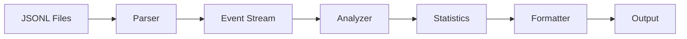

# cctoolstats アーキテクチャ設計

## 概要

cctoolstatsは、Claude Codeのツール呼び出しとサブエージェント実行履歴を分析・可視化するCLIツールです。TypeScriptで実装し、npx経由でインストール不要で実行可能にします。

## 設計原則

1. **シンプルさ優先**: ccusageの精神を受け継ぎ、必要最小限の機能から始める
2. **拡張性**: 将来の機能追加を考慮したモジュラー設計
3. **パフォーマンス**: 大量のログファイルも効率的に処理
4. **エラー耐性**: データ欠損や不正なフォーマットに対する堅牢性
5. **ユーザビリティ**: 直感的なCLIインターフェースと分かりやすい出力

## 全体アーキテクチャ

```
┌─────────────────────────────────────────────────────┐
│                    CLI Interface                     │
│                   (src/cli.ts)                       │
└─────────────────────────────────────────────────────┘
                           │
                           ▼
┌─────────────────────────────────────────────────────┐
│                   Core Engine                        │
│                 (src/index.ts)                       │
├─────────────────────────────────────────────────────┤
│  ┌──────────┐  ┌──────────┐  ┌──────────────────┐  │
│  │  Parser  │  │ Analyzer │  │    Formatter     │  │
│  └──────────┘  └──────────┘  └──────────────────┘  │
└─────────────────────────────────────────────────────┘
                           │
                           ▼
┌─────────────────────────────────────────────────────┐
│                  Data Sources                        │
│        ~/.claude/projects/*.jsonl                    │
│        ~/.config/claude/projects/*.jsonl             │
└─────────────────────────────────────────────────────┘
```

## モジュール設計

### 1. CLI Interface (`src/cli.ts`)

**責務**: コマンドライン引数の解析とユーザーインタラクション

**主要機能**:
- コマンドライン引数のパース（commander.js使用）
- ヘルプとバージョン情報の表示
- 設定の読み込みと検証

**オプション設計**（Fish関数版を参考）:
```typescript
interface CLIOptions {
  days?: number;           // 分析期間（デフォルト: 7）
  project?: string;        // プロジェクトパス（デフォルト: カレント）
  agents?: boolean;        // サブエージェント統計のみ
  tools?: boolean;         // ツール統計のみ
  json?: boolean;          // JSON出力
  verbose?: boolean;       // 詳細モード
  format?: 'table' | 'csv' | 'json';  // 出力フォーマット
}
```

### 2. Parser Module (`src/parser/`)

**責務**: JSONLファイルの読み込みと解析

**主要コンポーネント**:

```typescript
// src/parser/types.ts
interface TranscriptEvent {
  timestamp: string;
  type: 'user' | 'assistant' | 'tool_use' | 'tool_result' | 'system';
  message?: {
    usage?: TokenUsage;
    model?: string;
    content?: Content[];
  };
  tool?: string;
  input?: any;
  output?: any;
  costUSD?: number;
}

interface TokenUsage {
  input_tokens: number;
  output_tokens: number;
  cache_creation_input_tokens?: number;
  cache_read_input_tokens?: number;
}
```

**実装詳細**:
- ストリーミングパーサーで大きなファイルも効率的に処理
- Zodによるスキーマ検証
- エラー行のスキップと報告

### 3. Analyzer Module (`src/analyzer/`)

**責務**: パースされたデータの集計と分析

**主要コンポーネント**:

```typescript
// src/analyzer/subagent.ts
class SubagentAnalyzer {
  analyze(events: TranscriptEvent[]): SubagentStats {
    // Task呼び出しを集計
    // SubagentStopイベントで完了時間を計測
  }
}

// src/analyzer/tool.ts
class ToolAnalyzer {
  analyze(events: TranscriptEvent[]): ToolStats {
    // ツール使用頻度を集計
    // 成功/失敗率を計算
  }
}

// src/analyzer/timeline.ts
class TimelineAnalyzer {
  analyze(events: TranscriptEvent[]): TimelineStats {
    // セッションごとのイベントを時系列で整理
    // 実行パターンを分析
  }
}
```

### 4. Formatter Module (`src/formatters/`)

**責務**: 分析結果の整形と出力

**出力フォーマット**:
- **Table**: ターミナル用のテーブル表示（cli-table3使用）
- **CSV**: スプレッドシート連携用
- **JSON**: プログラム連携用
- **Markdown**: レポート生成用

**実装例**:
```typescript
// src/formatters/table.ts
class TableFormatter {
  format(stats: AnalysisResult): string {
    // ASCIIアートとカラーで見やすく表示
    // 絵文字を使った視覚的な表現
  }
}
```

## データフロー



1. **ファイル検索**: 新旧両方のパスからJSONLファイルを検索
2. **パース**: 各行をJSONとして解析、エラー行はスキップ
3. **フィルタリング**: 期間やプロジェクトで絞り込み
4. **集計**: ツール/サブエージェントを集計
5. **整形**: 指定されたフォーマットで出力

## エラーハンドリング

### 想定されるエラーと対処

1. **ファイルが見つからない**
   - 新旧両方のパスを確認
   - 明確なエラーメッセージ

2. **不正なJSON形式**
   - 該当行をスキップして続行
   - verboseモードでエラー詳細を表示

3. **権限エラー**
   - ユーザーに権限確認を促す
   - 代替パスの提案

4. **メモリ不足**
   - ストリーミング処理で対応
   - 必要に応じて期間を分割

## パフォーマンス最適化

1. **遅延読み込み**
   - 必要なファイルのみ読み込み
   - 期間フィルタを早期適用

2. **並列処理**
   - 複数ファイルの並列パース
   - Worker Threadsの活用（大規模データ時）

3. **キャッシュ**
   - 解析結果の一時キャッシュ
   - 15分間の自動クリーンアップ

## テスト戦略

### ユニットテスト
- 各モジュールの独立テスト
- モックデータによる境界値テスト

### 統合テスト
- エンドツーエンドのシナリオテスト
- 実際のJSONLファイルを使用

### パフォーマンステスト
- 大量データでの処理時間測定
- メモリ使用量の監視

## 配布戦略

### npm パッケージ
```json
{
  "name": "cctoolstats",
  "bin": {
    "cctoolstats": "./dist/cli.js"
  },
  "files": [
    "dist",
    "README.md",
    "LICENSE"
  ]
}
```

### npx 対応
- パッケージサイズの最小化
- 依存関係の最適化
- 初回実行時のキャッシュ

## 将来の拡張計画

### Phase 1（MVP）
- [x] 基本的なサブエージェント統計
- [x] ツール使用頻度の表示
- [x] シンプルなテーブル出力

### Phase 2（拡張）
- [ ] タイムライン表示
- [ ] CSV/JSON出力
- [ ] 設定ファイル対応
- [ ] セッション分析

### Phase 3（高度な機能）
- [ ] リアルタイム監視（フック連携）
- [ ] Webダッシュボード
- [ ] 履歴の比較分析
- [ ] AIによる使用パターン分析

## 依存関係

### 必須依存関係
- `commander`: CLIフレームワーク
- `zod`: スキーマ検証
- `cli-table3`: テーブル表示
- `chalk`: カラー出力

### 開発依存関係
- `typescript`: 型安全性
- `@types/node`: Node.js型定義
- `vitest`: テストフレームワーク
- `eslint`: コード品質
- `prettier`: コードフォーマット

## セキュリティ考慮事項

1. **ファイルアクセス**
   - ユーザーのホームディレクトリ内のみアクセス
   - シンボリックリンクの適切な処理

2. **データプライバシー**
   - 機密情報のフィルタリング
   - 出力時のサニタイズ

3. **依存関係**
   - 定期的な脆弱性スキャン
   - 最小限の依存関係

## 参考実装

### Fish関数版（claude-subagent-stats.fish）
起動オプションと基本的な集計ロジックの参考として活用。ただし、実装言語の違いから、直接的なコード移植は行わない。

### ccusage
データ構造とスキーマ定義の参考。特に以下の点を参考にする：
- JSONLパーサーの実装
- エラーハンドリング
- 出力フォーマット

## まとめ

cctoolstatsは、シンプルさと拡張性のバランスを重視した設計とします。MVPでは基本的な統計機能に集中し、ユーザーフィードバックを基に段階的に機能を追加していきます。ccusageがコスト分析を担う一方で、cctoolstatsはClaude Code特有のサブエージェント分析やツール使用パターンに特化した価値を提供します。